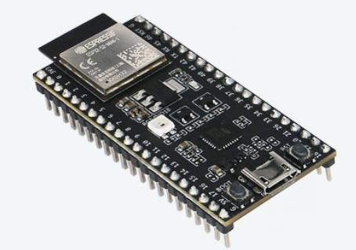
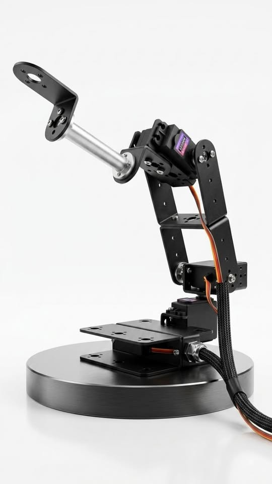
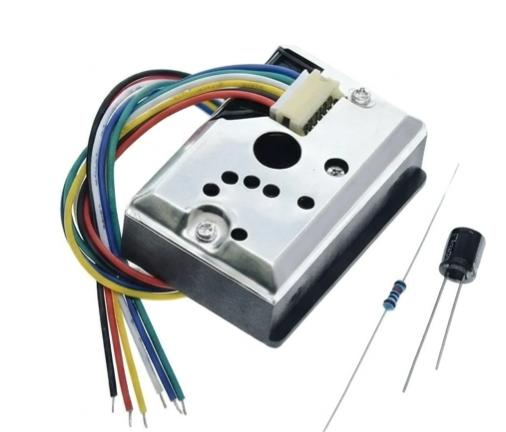
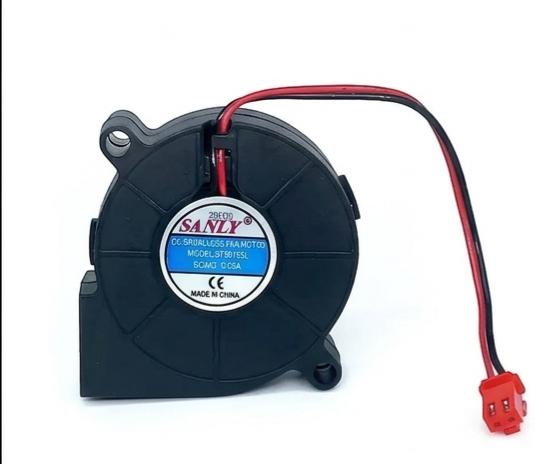
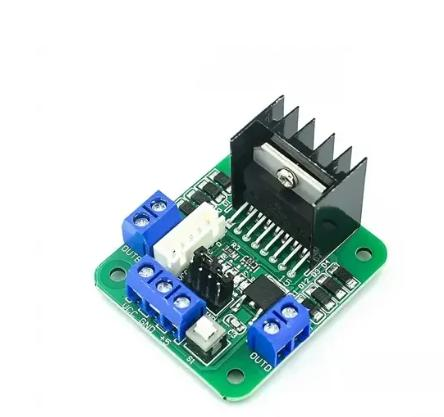
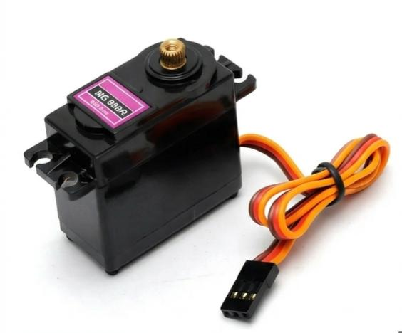
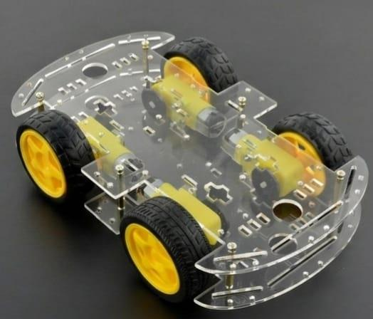
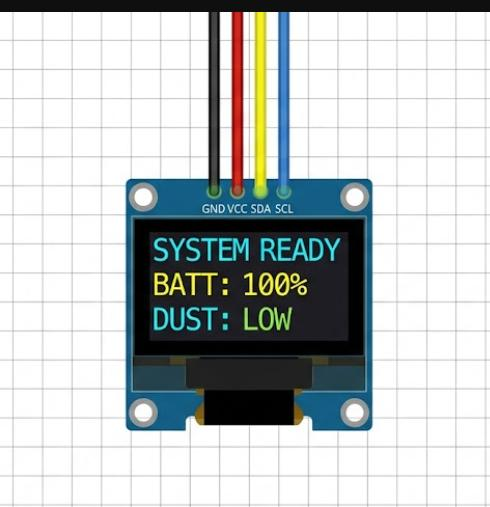

# **AURA** (Antiquity Universal Restoration Automation)

## **Dust Free History**

## Table of Contents
- [Dust Free History](#dust-free-history)
- [Project Overview](#project-overview)
- [Team Information](#team-information)
- [Team Members](#team-members)
- [Problem Statement](#problem-statement)
- [Solution](#solution)
- [Background](#background)
  - [Existing Solutions](#existing-solutions)
  - [Why Our Solution Is Superior](#why-our-solution-is-superior)
  - [How We Conjured This Idea](#how-we-conjured-this-idea)
- [Project Build Process](#project-build-process)
  - [Assembly Steps](#assembly-steps)
  - [How It Works](#how-it-works)
  - [Project Flow](#project-flow)
- [Key Components](#key-components)

## Dust Free History

---

## Project Overview
AURA is an intelligent robotic cleaning system designed to protect delicate historical artifacts in museums and galleries. It uses a compact vacuum mounted on a robotic arm to remove dust without physically touching the object. The system is equipped with distance and dust sensors to ensure safe, precise, and energy-efficient operation.

## Team Information
**Team Name:** AURA FARMERS  
**Category:** Future Innovators  
**Group:** Junior  
**Country:** Bangladesh  

## Team Members
**MD MOHAFIZUR RAHMAN (Leader):** Our leader Mohafizur handled the software part of AURA. He goes to Udayan Higher Secondary School. He reads class 8.

**MD NABHAN NUBAID (2ND MEMBER):** 2nd member and coordinator of hardware and physical components. Compiled the main frame and other hardware-related components. He studies at St. Joseph Higher Secondary School in the 8th grade. He hails from Lalmonirhat, Rangpur but currently resides in Dhaka. He is fond of tomatoes.

**KAZI TASFIA ALAM (3RD MEMBER):** 3rd member, responsible for handling the project documentation and written reports. She is a Grade 7 student at Maple Leaf International School.

## Problem Statement
Artifacts in museums and galleries gradually accumulate dust, which can cause chemical degradation and physical damage. Traditional cleaning methods are often slow, labor-intensive, and risky for fragile objects.

## Solution
AURA provides a non-contact cleaning solution that detects dust and maintains a safe distance from artifacts. This reduces the risk of damage, lowers manual effort, and improves cleaning efficiency.

## Background
### Existing Solutions
#### 1. Traditional Manual Conservation (Current Standard)
- **How it works:** Trained conservators use soft brushes, low-suction hand-held micro-vacuums, and HEPA-filtered extraction units.
- **Limitations:** This approach is labor-intensive, slow, expensive, and relies on human skill. It also carries risk of accidental physical contact with fragile surfaces.

#### 2. Commercial Autonomous Floor Cleaners
- **Examples:** *Pudu Robotics CC1/MT1*, *Gausium Vacuum 40*, *SoftBank Robotics Whiz*.
- **How it works:** LiDAR- and vision-guided robots roam galleries to sweep, vacuum, and scrub floors.
- **Limitations:** These systems only clean floor areas and cannot reach elevated display cases, fragile artifacts, or complex 3D surfaces.

#### 3. Industrial Articulated Cleaning Arms
- **Examples:** Custom 6-DOF robotic arms from KUKA or Universal Robots adapted with soft brushes or suction heads.
- **How it works:** Fixed robots move along predefined paths to clean specialized surfaces in industrial or display environments.
- **Limitations:** These systems are costly, bulky, and typically lack autonomous mobility and delicate non-contact sensing for fragile objects.

### Why Our Solution Is Superior
- **Artifact Safety First:** The VL5303X ToF sensor keeps the nozzle at a safe, non-contact distance from the artifact, avoiding contact and mechanical damage.
- **Targeted, Energy-Efficient Operation:** The GP2Y1014AU0F dust sensor activates suction only when dust is detected, reducing unnecessary operation and airflow around fragile items.
- **Precision Cleaning Motion:** The robotic arm reaches the artifact directly and cleans only the dusty areas, minimizing wear and protecting sensitive surfaces.

### How We Conjured This Idea
We wanted to protect our cultural heritage by creating a practical alternative to manual cleaning and floor-only robots. Artifacts are slowly damaged by dust and improper handling, and current cleaning methods either risk physical contact or cannot reach delicate displays.

By combining precise non-contact distance sensing with optical dust detection, we designed a smart robotic system that cleans only when needed. The result is a safe, no-touch cleaning robot that uses localized suction to remove dust without touching the artifact.

We also considered ultrasonic cleaning because it would avoid physical contact, require less moving machinery, and could cover complex shapes. However, ultrasonic airflow only scatters dust rather than collecting it, so it does not actually clean the surface.

## Project Build Process
AURA was built by combining a compact mobile base, a lightweight robotic arm, and a smart sensing system. The chassis, motors, sensors, and control board were arranged to deliver precise, low-impact cleaning for fragile museum objects.

### Assembly Steps
1. Build the acrylic chassis and mount the 12V DC gear motors for the wheels.
2. Assemble the aluminium robotic arm and attach the MG996R servos at each joint.
3. Secure the ESP32 controller on the chassis and wire the VL5303X distance sensors and GP2Y1014AU0F dust sensor.
4. Install the 5015 blower fan and connect it to the nozzle and filter path for suction.
5. Connect the wheel motors and servos to the L298N motor drivers, then wire the drivers to the ESP32.
6. Attach the OLED display and configure it to show live system status and sensor readings.
7. Verify the power wiring, then test the sensor readings, arm movement, and vacuum operation.

### How It Works
AURA uses the ESP32 to monitor the distance sensors and dust sensor. When dust is detected, the controller activates the blower and moves the arm to clean the surface while keeping the nozzle at a safe distance. The mobile base allows the system to position itself near artifacts, and the OLED displays the current status.

### Project Flow
- Build → Connect → Test
- Chassis, motors, and arm assembled first
- Sensors and controllers wired next
- System tested for motion, dust detection, and suction

## Key Components
| Component | Function | How it Works | Price Range | Image |
|---|---|---|---|---|
| ESP32 microcontroller | Main control unit | Runs the robot firmware, reads sensors, and controls motors and actuators | ৳450 – ৳550 |  |
| VL5303X Time-of-Flight Sensor | Distance sensing | Measures distance to the artifact using infrared light and returns precise range data | ৳550 – ৳650 |  |
| GP2Y1014AU0F Dust Sensor | Dust detection | Detects airborne dust particles using infrared light scattering and triggers cleaning when dust is present | ৳700 – ৳850 |  |
| 5015 Blower Fan | Suction source | Creates airflow through the nozzle and filter path to remove dust from the artifact area | ৳180 – ৳220 |  |
| L298N Motor Driver | Motor power control | Converts control signals from the ESP32 into higher-current motor drive outputs | ৳180 – ৳220 |  |
| MG996R Servo Motor | Arm joint actuation | Provides torque for the shoulder, elbow, and wrist joints of the robotic arm | ৳650 – ৳750 |  |
| 12V DC Gear Motor | Mobile drive | Drives the wheels of the mobile chassis with speed and torque suited for the robot base | ৳350 – ৳550 |  |
| OLED Display (0.96" I2C) | Status display | Shows system status, sensor readings, and operational messages | ৳320 – ৳400 |  |
| Acrylic Robot Arm Kit | Structural frame | Provides the physical arm structure and mounting points for sensors and servos | ৳1,200 – ৳1,600 |  |

## Component Descriptions

### ESP32 Microcontroller
The ESP32 is the main controller of the AURA system. It executes the control logic, reads data from the sensors, and sends drive signals to the motors and servos.

### VL5303X Time-of-Flight Sensors
These sensors measure the distance to the artifact without contacting it. They use a light pulse and timing measurement to determine the exact range, enabling the arm to maintain a safe cleaning distance.

### GP2Y1014AU0F Dust Sensor
This optical dust sensor detects fine particles in the air near the artifact. When the sensor detects dust above a threshold, it signals the ESP32 to activate the vacuum system.

### 5015 Blower Fan
The blower fan provides the suction force needed to pull dust particles through the nozzle and into the filter chamber. It is sized to deliver enough airflow while remaining compact and quiet.

### L298N Motor Driver
The L298N driver modules allow the ESP32 to control DC motors and servos. They handle the current required by the motors, enabling safe and responsive movement of the robot and arm.

### MG996R Servo Motors
These high-torque servos power the three joints of the robotic arm. They enable precise positioning of the nozzle and allow the arm to move smoothly around artifacts.

### 12V DC Gear Motors
The gear motors drive the robot’s wheels and provide traction for mobility. Their geared design supplies stable torque and speed for navigation across museum floors.

### OLED Display
The OLED screen shows real-time information such as battery status, sensor readings, and operating mode. It helps operators monitor the robot during use.

### Acrylic Robot Arm Kit
The acrylic arm kit provides a lightweight, durable structure for the robot arm. It supports the mounted sensors, nozzle, and servos while keeping the overall system compact.

## Development Notes
The system is built on a lightweight mobile chassis with a three-joint robotic arm. It uses sensors to detect both the artifact and dust before activating suction. A filter chamber and load sensor are included to collect and monitor dust.

## Conclusion
AURA aims to support the preservation of cultural heritage through safe, automated, and efficient artifact cleaning.

We also considered ultrasonic cleaning because it would avoid physical contact, require less moving machinery, and could cover complex shapes. However, ultrasonic airflow only scatters dust rather than collecting it, so it does not actually clean the surface.

Project Build Process
AURA was built by combining a compact mobile base, a lightweight robotic arm, and a smart sensing system. The chassis, motors, sensors, and control board were arranged to deliver precise, low-impact cleaning for fragile museum objects.

Assembly Steps
Build the acrylic chassis and mount the 12V DC gear motors for the wheels.
Assemble the aluminium robotic arm and attach the MG996R servos at each joint.
Secure the ESP32 controller on the chassis and wire the VL5303X distance sensors and GP2Y1014AU0F dust sensor.
Install the 5015 blower fan and connect it to the nozzle and filter path for suction.
Connect the wheel motors and servos to the L298N motor drivers, then wire the drivers to the ESP32.
Attach the OLED display and configure it to show live system status and sensor readings.
Verify the power wiring, then test the sensor readings, arm movement, and vacuum operation.
How It Works
AURA uses the ESP32 to monitor the distance sensors and dust sensor. When dust is detected, the controller activates the blower and moves the arm to clean the surface while keeping the nozzle at a safe distance. The mobile base allows the system to position itself near artifacts, and the OLED displays the current status.

Project Flow
Build → Connect → Test
Chassis, motors, and arm assembled first
Sensors and controllers wired next
System tested for motion, dust detection, and suction
Key Components
Component	Function	How it Works	Price Range	Image
ESP32 microcontroller	Main control unit	Runs the robot firmware, reads sensors, and controls motors and actuators	৳450 – ৳550	ESP32
VL5303X Time-of-Flight Sensor	Distance sensing	Measures distance to the artifact using infrared light and returns precise range data	৳550 – ৳650	VL5303X
GP2Y1014AU0F Dust Sensor	Dust detection	Detects airborne dust particles using infrared light scattering and triggers cleaning when dust is present	৳700 – ৳850	Dust Sensor
5015 Blower Fan	Suction source	Creates airflow through the nozzle and filter path to remove dust from the artifact area	৳180 – ৳220	Blower Fan
L298N Motor Driver	Motor power control	Converts control signals from the ESP32 into higher-current motor drive outputs	৳180 – ৳220	L298N
MG996R Servo Motor	Arm joint actuation	Provides torque for the shoulder, elbow, and wrist joints of the robotic arm	৳650 – ৳750	MG996R
12V DC Gear Motor	Mobile drive	Drives the wheels of the mobile chassis with speed and torque suited for the robot base	৳350 – ৳550	DC Gear Motor
OLED Display (0.96" I2C)	Status display	Shows system status, sensor readings, and operational messages	৳320 – ৳400	OLED Display
Acrylic Robot Arm Kit	Structural frame	Provides the physical arm structure and mounting points for sensors and servos	৳1,200 – ৳1,600	Acrylic Arm
Component Descriptions
ESP32 Microcontroller
The ESP32 is the main controller of the AURA system. It executes the control logic, reads data from the sensors, and sends drive signals to the motors and servos.

VL5303X Time-of-Flight Sensors
These sensors measure the distance to the artifact without contacting it. They use a light pulse and timing measurement to determine the exact range, enabling the arm to maintain a safe cleaning distance.

GP2Y1014AU0F Dust Sensor
This optical dust sensor detects fine particles in the air near the artifact. When the sensor detects dust above a threshold, it signals the ESP32 to activate the vacuum system.

5015 Blower Fan
The blower fan provides the suction force needed to pull dust particles through the nozzle and into the filter chamber. It is sized to deliver enough airflow while remaining compact and quiet.

L298N Motor Driver
The L298N driver modules allow the ESP32 to control DC motors and servos. They handle the current required by the motors, enabling safe and responsive movement of the robot and arm.

MG996R Servo Motors
These high-torque servos power the three joints of the robotic arm. They enable precise positioning of the nozzle and allow the arm to move smoothly around artifacts.

12V DC Gear Motors
The gear motors drive the robot’s wheels and provide traction for mobility. Their geared design supplies stable torque and speed for navigation across museum floors.

OLED Display
The OLED screen shows real-time information such as battery status, sensor readings, and operating mode. It helps operators monitor the robot during use.

Acrylic Robot Arm Kit
The acrylic arm kit provides a lightweight, durable structure for the robot arm. It supports the mounted sensors, nozzle, and servos while keeping the overall system compact.

Development Notes
The system is built on a lightweight mobile chassis with a three-joint robotic arm. It uses sensors to detect both the artifact and dust before activating suction. A filter chamber and load sensor are included to collect and monitor dust.

Conclusion
AURA aims to support the preservation of cultural heritage through safe, automated, and efficient artifact cleaning.

## Sources
- Research and inspiration from Gemini and Google.
- Guidance and help from this AI assistant during the README creation process.
- Project hosting and version control provided through GitHub.
- Components purchased from Robotics Shop BD and Electronic Shop BD.
